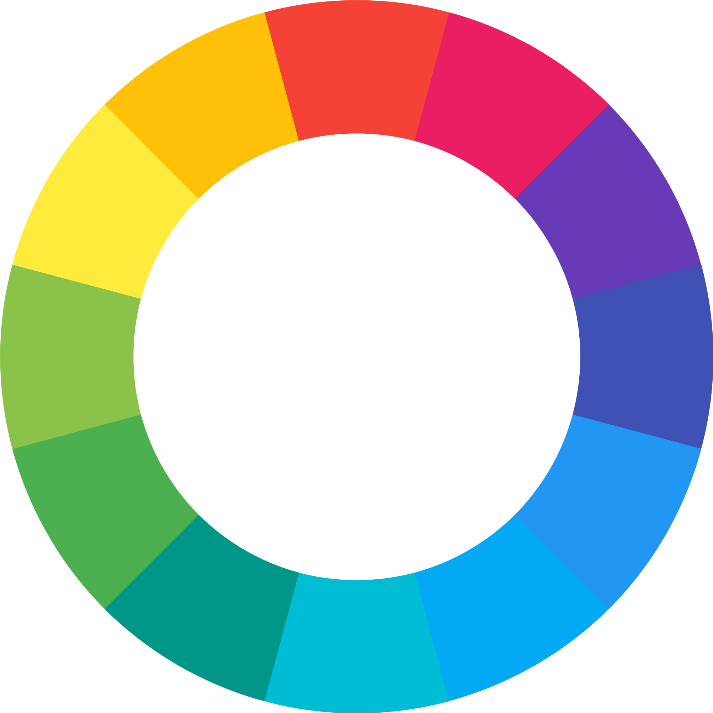
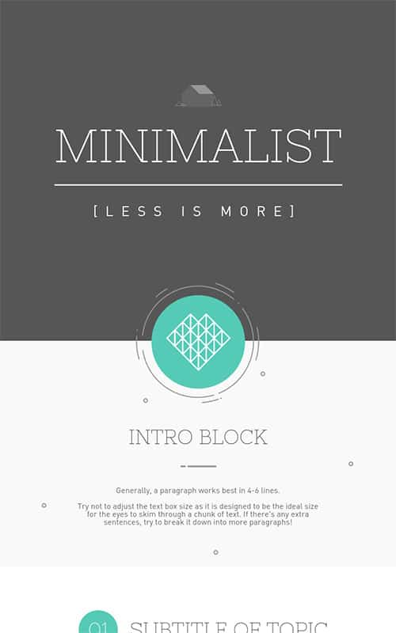
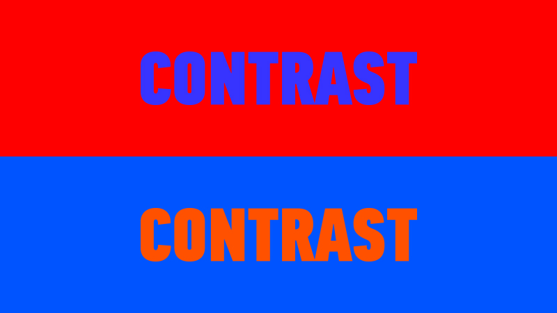
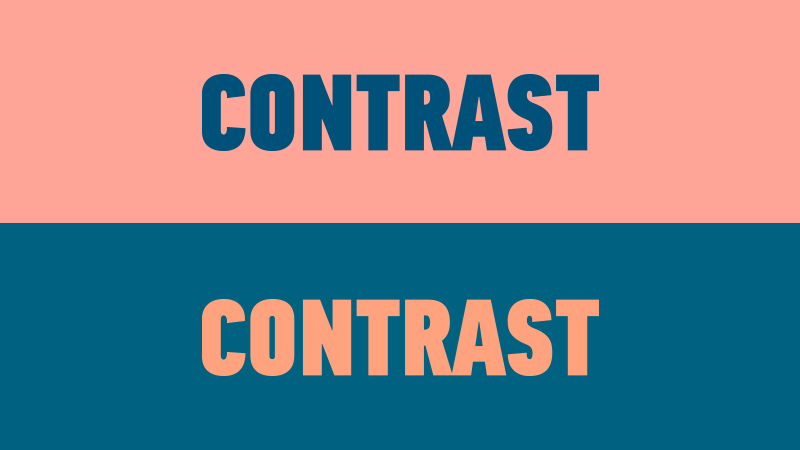
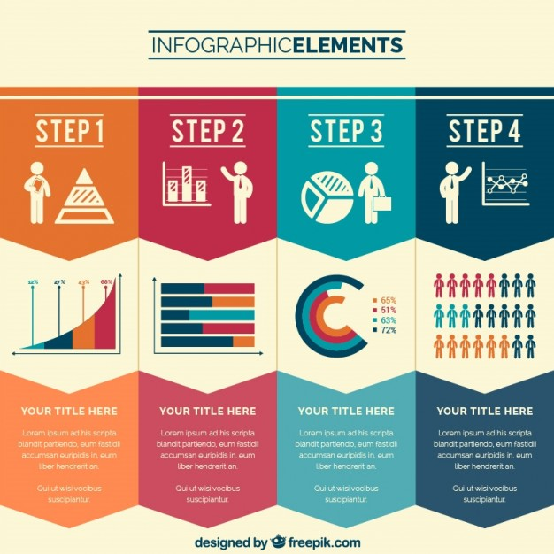
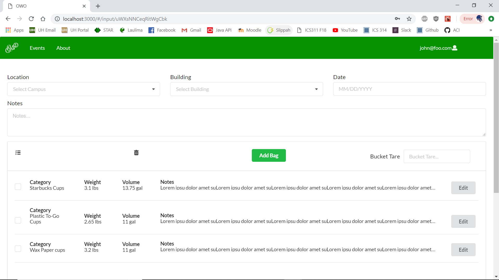

## Early Teachings
Some of my core design concepts are founded upon a single acronym I learned long ago as a junior in high school. I took an IT internship that Kamehameha Schools was offering, and the first two weeks were spent with a team that specialized in design and infographics. Before sending us off to make infographics of our own, we were taught the principles of C.R.A.P., which stood for **C**ontrast, **R**epetition, **A**lignment, and **P**roximity. These principles were very basic guidelines of how to make any design look organized and complete.

### Contrast
Color is a huge part of design, and it can be very easy to screw up if you aren't aware of what colors would go well together. Having good contrast ensures that your text and graphics stand out and are clearly visible. A good reference that I learned from my internship was to look for colors that are opposite each other on the color wheel. 

I've frequenty just googled 'infographics' to look for inspiring colors to use in different designs. As I've learned, less is more, and typically you don't want more than around 3-4 different colors or things start to look messy. Because of this, I try to limit myself to 3 basic colors at most. Having a limited color pallete makes the content look unified and neat. Take this infographic for example; the amount of different colors is minimal, and the use of blue against black and white makes it pop and gives it a nice contrast.

Additionally, you don't HAVE to use colors that are opposites on the color wheel if you have a clever way of using them. Take a look at these two examples. This first one which features the colors red and blue just downright makes your eyes scream - you know what I'm talking about. Don't be that person that uses colors that strain a viewer's eyes like this. 

However, take a look at this example. They're the same two colors, but in different shades. This is a good example of contrast, and it isn't harsh on the eyes at all.

Contrast doesn't just lie in color, though. Other types of contrast that can be used to benefit your design can be size, whether it be the size of text or size of different shapes. In this essay, for example, I made the headline 'Early Teachings' bigger than 'Contrast', to emphasize that the subject 'Contrast' falls under 'Early Teachings'. Contrasting sizes can send small meanings to the viewer and make the design of whatever you make more comprehensible.

### Repetition
Repetition is also important for the unity of a design; designs are all about maintaining patterns. Examples of repetition can be:
<ul>
  <li>Use of color for certain functions</li>
  <li>Shapes (of pictures, graphics, etc)</li>
  <li>Font</li>
</ul>
...See what I just did there? The use of dots to make a bulleted list is an example of repetition too! Bet ya didn't see that one coming did you? Consistency is what unifies different elements, website pages, etc.

### Alignment
Alignment refers to where elements are placed in reference to each other. Typically, elements should be aligned so that their margins line up with each other. Alternatively, if they don't, there could be a repetition of staggered elements where every other element is aligned to each other.
Check out this image of an example infographic, and note that how each of the shapes, along with the icons and text inside each of the shapes line up to each other. 

This design utilizes all the previously mentioned concepts of color and repetition as well; note that each of the graphs within each shape use the repeating colors of the entire infographic. As for myself, I always need to take alignment into consideration for my workplace since I'm tasked with creating program materials for various seminars. For example, for a particular program called #galswithlei, I needed to organize all the logos of the sponsors of the event, and I needed to find the appropriate alignment to organize them in an eye-pleasing way. It wasn't easy, but this was the result: 

Finally, for your benefit, here's a contrasting example of good and bad alignment:

I think it's obviously why the good example is better than the bad one. We even practice alignment when turning in correctly formatted code (think about lining up opening and closing divs in html).

### Proximity
The concept of proximity basically states that related objects should be placed closer together. This can make it easier for users to find related information instead of having to have their eyes wander all over the place. A good example of this is business cards. Take a look:

Note how the occupation's proximity is close to the name of the person, and the rest of the contact information is grouped together in another column. Lots of business cards and personal information in general follow this general format, and a person's occupation and organization are often grouped closer to their name.

## Bringing It All Together
The most recent example of my application of these principles is in the final project for 314; our project revolved around the UH Trash audits that are conducted annually. The original inspiration of the project was for the 2018 HACC competition, whose theme was sustainability. We chose the colors green, black, and white for our website to reflect the theme, and for our final project, I worked on designing the input page. This version of the Oahu Waste Organizer app is designed with Semantic UI, which helps give a consistent look to all of the text boxes and surrounding segments.

I tried to align all the input boxes in an organized manner on the top, and spent a lot of time figuring out how to align each of the columns of Category, Weight, etc so they would all line up and not be affected by how long the category was. I made sure that the information of each of the columns was closer to the column name, like how 13.1 lbs is closer to Weight, and doesn't have any white space between. It's still a work in progress, but you can see how a bit of each of the principles of C.R.A.P. have been incorporated into the design of this page.
