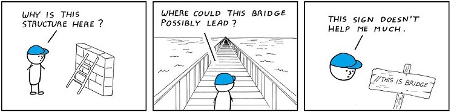

# Introduction

Whether you're in school or beginning at your first job out there in the *Real World*, you need to be ready because at some time - at some point - *someone* is going to read your code. And you'd better hope when that someone reads your code (because that someone will most likely be either an instructor grading your work or a colleague) that they aren't scratching their heads regretting they even put themselves up to the task. This is where *coding standards* come in!

# The Pros to Using Coding Standards

Good coding standards ensure readability and comprehension of your own code. Having a consistent coding style can help you to better understand your own code and your reasoning behind it. Imagine having inconsistent code where in some places there's spaces between a function name and the parameters, and in some places there is none. Although it's not one of the more important issues, coding standards help with the general aesthetics of your code as well. It feels miles better to read organized, nicely formatted code than sloppy, inconsistent code. Imagine having no standard on how starting curly braces are set, and dealing with a code that has them sometimes on the same line, and sometimes on the new line after it. It's the tiny inconsistencies like that not only within coding but life itself that are mildly irritating enough to make one say "Ok, SOMEONE fix that!" Think about this; you just arrived home after a long day at work. You're starving. You order a delicious pepperoni pizza, since that's your favorite. In 15 minutes, the pizza arrives at your door and you eagerly open it only to realize to your dismay, that the pizza has been sliced in all sorts of differently sized pieces!

**DON'T BE THAT PERSON. DON'T CUT PIZZAS LIKE THAT. AND DON'T WRITE TERRIBLY FORMATTED CODE.**

Coding standards not only help you to better retain your intentions behind your code, but it helps others who may be looking at your code. Imagine looking at one coding style and then immediately looking at another that does the exact same thing. The contrasting effect is not very pleasant. Coding standards add *consistency* to your code. Think about this; you would easily be able to comprehend anyone's code if they write it according to the same coding standard as you. Anyone who is familiar with the same standards would be able to look at your code and contribute to or edit it easily. If you work at a company, writing with a preferred coding standard will ensure that any code you write will be usable by future employees. If you think about it, it's really all about making life easier for everyone.

# Personal Experience

My experience of using ESLint with IntelliJ has been nothing but a positive one. I don't have any coding experience outside of college, so when I took my first class (ICS 111), we were immediately taught good coding standards from the start. I suppose that's why for me, it's easy for me to conform to different coding standards. They're all a little different, but not so much so that it's particularly annoying or hard to follow. Once I learned the basics of ESLint coding standards, I really had no problem getting the little green check mark in the upper right corner of my IntelliJ window. I could understand how someone who was originally self taught could be a little stubborn about not following particular coding standards since they've made up their own way to code things in a way that's understandable to *them*, but I think coding standards exist so that the readability of code is better for everyone.

All in all, there's no real downside to using coding standards, so why not? However, at the end of the day, anyone is free to agree or disagree with me.
