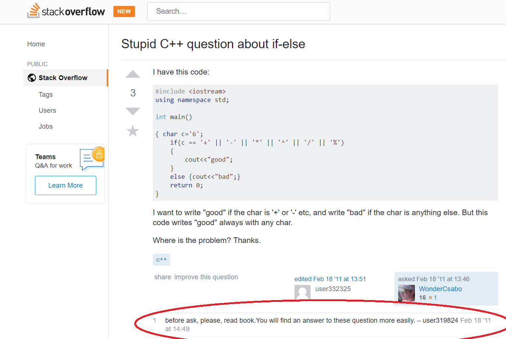
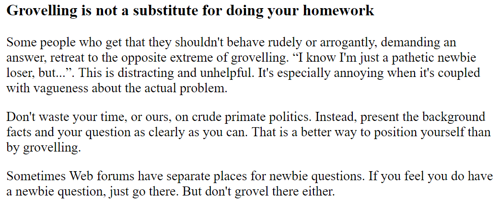
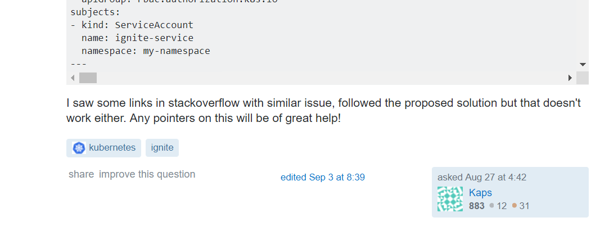

## Introduction
If you have not yet read [How to ask questions the smart way](http://www.catb.org/esr/faqs/smart-questions.html) by Eric Raymond, I suggest you do before continuing on. Raymond discusses common mistakes newbies make when searching for help or information on online forums, along with helpful guides on what would be an appropriate way to ask for assistance.

## What's a Bad Question?
I did some searching of my own, and was pleasantly surprised that I had to do quite a bit of hunting before I found a legit bad question on StackOverflow. Here's what I found, as a result of searching "stupid question" in the search bar:

Let's first note the unhelpful title: "Stupid C++ question about if-else". One of the points Raymond makes is that "grovelling is not a substitute for doing your homework". Take note:

An attempt to receive pity will most likely not be successful in attracting helpful answers. It just makes you, the asker of the question, appear whiny and immature. This person in particular definititely made my eyes roll just from reading the title.

There are several other things to note about this question that make the nature of it objectively "bad".

1) The user simply pastes their code in and does not show that they have made any visible effort to solve the question on their own. If they think their question is so stupid (implying that they think it is a simple and easy question that they cannot understand), why not use their resources to try and find the answer? Such simple questions should be easy to find on the internet, right? Notably, as seen in the red circle I have drawn over the image, someone has also pointed this out and suggests reading the book might've been a wise choice before turning to the forums.
2) They ask "where is the problem?", indicating that they want a quick solution instead of figuring out the answer themself. Raymond also mentions that there is a clear difference between asking for pointers to achieve a goal and simply waiting for the answer to drop from the sky.

The bottom line is, people can tell when you put in minimal effort to solve the question yourself; seeing the response to this user's question just solidifies that. This is YOUR problem after all, so why should someone have to put in their valuable time to solve your question when you don't even put in the effort to solve it yourself? The underlying moral of coding and programming is that you're constantly learning from your mistakes. However, it's quite hard to learn anything at all if you don't even know where you went wrong. Mistakes are a vital part of the learning process, and attempting to make someone else solve your mistakes for you is only creating a hindrance to yourself.

## What's a Good Question?
It was way faster to find a good question, which greatly restores my faith in humanity.

First of all, the title is descriptive and gives good insight as to what the problem is. Unlike the "bad" example, it does not beg for anyone's pity. They follow up by sharing the error that they encountered and the different strategies they have attempted. They mention that they have referenced the a documentation and have made an attempt to solve the problem on their own. This is followed along with a sample of their own coding attempt. The rest of the post is as follows:

This user's question is made even better as they indicate that they have made the attempt to search through StackOverflow for the solution before asking the question. It's always important to check the FAQs and forums to see if it's a commonly asked question or if someone has already asked the question before. Doing this will not only save your time, but everyone else's time; nobody wants to go through the effort to answer the same question twice. Not to mention it also saves you the embarassment of looking ignorant. 

However, the best part of the question is the last sentence: 

> Any pointers on this will be of great help!

They ask for POINTERS on their question; they don't expect to simply be handed the answer. We can see from the community's answers that others are more receptive to help this person because they are actively trying to educate themselves rather than sponging up information.

The user actively follows up with responses and respectfully works with the community to solve the solution. When you respect the community, the community respects you back. Overall, this is a good example that really shows that you get what you give. Raymond makes it clear that the world of hackers and technology experts is a ruthless place. Respect is something to be earned, not demanded.

## How Smart Questions Lead to Smart Practices
Blindly relying on others is a slippery slope, and I can say this firsthand because that's a mistake that I have made in the as a young ignorant student. It's addicting because it's like receiving a quick fix without putting in the back-breaking effort yourself. You'll get a bad feeling in your stomach, and probably tell yourself something like "I should really attempt this next problem myself," and you will, only to find that you're completely unable to even find where to start on it, because you've already crippled yourself from the beginning. So you'll find yourself searching for more and more cheap solutions and quick answers, without learning much of anything yourself. You'll be stuck with tiny meaningless bits and pieces of information that is impossible to link together because you didn't try from step 1.

To steer yourself away from making such mistakes, focusing on asking smart questions that search for tips and pointers rather than solutions can slowly build your foundation of understanding. Learning the small steps of how something works before solving something in its entirety not only builds understanding, but it builds confidence. The more confidence you build, the more motivation you'll have to solve future problems yourself. You'll be able to say, "I was able to solve A, so with the same dedication, I can solve B." A big part of software engineering, as I have said before, is making mistakes. This is something that is said quite frequently, but really does hold a lot of truth to it. If you have encountered a problem and figured out how to solve it, you will be able to solve similar problems with ease in the future; not to mention you can help future peers who encounter the same problem. Build yourself up instead of letting yourself sink!
