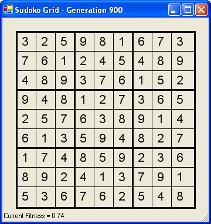

<div class="ui small rounded images">
  
</div>

## About

This was a project for my ICS 211 class. It was one of the more challenging projects that I remember, since a lot of factors needed to be taken into consideration when writing the code for this project. In this assignment, a recursive method is implemented to find a solution to a given Sudoku problem.

A Sudoku is a 9x9 grid of integers, each with values 1..9. A Sudoku is valid when each of the 9 rows, each of the 9 columns, and each of the 9 3x3 boxes in the grid has exactly one each of the possible values 1..9, without any duplicates. A Sudoku problem is a Sudoku grid with some of the grid cells already filled. The solution fills the remaining cells to give a valid Sudoku.

A recursive strategy for finding a solution to a Sudoku problem is as follows:

- If all cells are filled, see if this Sudoku is valid. If it is, this means the solution has been found. If not, this Sudoku is not a solution.

- If at least one cell is not filled, see what values are legal in this cell:

- If no values are legal, then this Sudoku is not a solution.

- If one or more values are legal, place each legal values in the cell in turn, one at a time. For each, recursively attempt to find a solution that fills the remaining empty cells.

- If a solution is found for at least one legal value, set the Sudoku to reflect this solution, and return that a solution was found.

- If no solution is found for any legal value, reset this cell to the value it had when this method was called, and report that this Sudoku does not have a solution.

Every time the code recursively attempts to find a solution, it will fill cells in the Sudoku grid. If the attempt is not successful, returning, the code must restore the Sudoku grid to the values had before the call.

## Role and Responsibility

This project was a homework assignment for 211; I did not work in a group for this, and so everything here is written and done by me, with some help from the teacher and the TA. I was responsible for writing the code to complete the hexadecimal problem, as well as writing the code to test it.

## What I learned

From this experience, I learned a lot about learning from mistakes and how important it is to really go back and trace through the code to find any errors. Tracing code was really helpful and essential to completing this project, and it's just a good habit overall, even when you think your code don't have any errors. This project was a good example of how many mistakes programmers will encounter in the coding process, and really taught the class that you have to think of all the possible outcomes in order to produce successful code that can handle all those outcomes.

### Sample Code

Here is a piece of the code from my project that initially checks if the sudoku is solved, and if not, searches for possible values for the next empty space:

```
public static boolean solveSudoku(int[][] sudoku, int row, int column) {
    // If sudoku is full and solved
    if (column == 16 || row == 16) {
      return true;
    }

    // If there's already a value in the cell, move on
    else if (sudoku[row][column] != -1) {
      if (column == 15) {
        return solveSudoku(sudoku, row + 1, 0);
      } else {
        return solveSudoku(sudoku, row, column + 1);
      }
    } else {
      ArrayList<Integer> possibleValues = legalValues(sudoku, row, column);
      if (possibleValues == null) {
        return false;
      } else {
        for (int i = 0; i < possibleValues.size(); i++) {
          sudoku[row][column] = possibleValues.get(i);
          boolean retVal = solveSudoku(sudoku, row, column);
          if (retVal == true) {
            return true;
          } else {
            sudoku[row][column] = -1;
          }
        }
        return false;
      }
    }

  }
```


