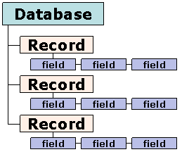

## About
The Records Database is a project I did for ICS 212 on UH Unix which contains functions and a user interface that shows the user a menu of choices for a database application. The program starts off as a blank database, and prompts the user with 5 options: Add a new record, print record information, print all database information, delete an existing record, and quit. The options are listed 1-5, and the user can choose one by typing the corresponding number. Each record has an account number, a name, and an address. After records have been added to the database, the database will retain the information of those records even after the program has been closed. Additionally, the program will sort the list by the different account numbers and increment a record if its account number is the same as an existing record.

## Roles and Responsibilities
This project was a homework assignment for ICS 212, and therefore I did not work on a team for this. I was responsible for creating everything, which included the user interface, the driver, the function to write a record into a database, the function to read a file in a database, and a debug mode.

## What I learned
In completing this project, I learned how to program with the user's best interest in mind; this means programming something based on how a user might see things, not how I might see things. I learned how to create something that's useer-friendly and easy to use. This project also taught me the importance of pointers in the C language, and to be careful when assigning values to different variables.
 
### Source Code
As a courtesy to the class, I will not be uploading my code to GitHub, as the teacher has had problems with cheating in the past. However, this is a sample from my code's user interface that gives a basic idea of what this project entails.

```
readfile(&start, "database.txt");
    
    while(exit == 0)
    {
        printf("MENU \n");
        printf("1: Add a new record\n");
        printf("2: Print record information\n");
        printf("3: Print all database information\n");
        printf("4: Delete an existing record\n");
        printf("5: Quit\n");  
        printf("To select an option, please enter the corresponding number.\n");
            
        if(scanf("%d", &userInput) == 1)
        {
            while ((getchar()) != '\n');
                
            if(userInput <= 0 || userInput > 5)
            {
                printf("ERROR: Your input is not one of the valid menu options.\n");
                    
            }
