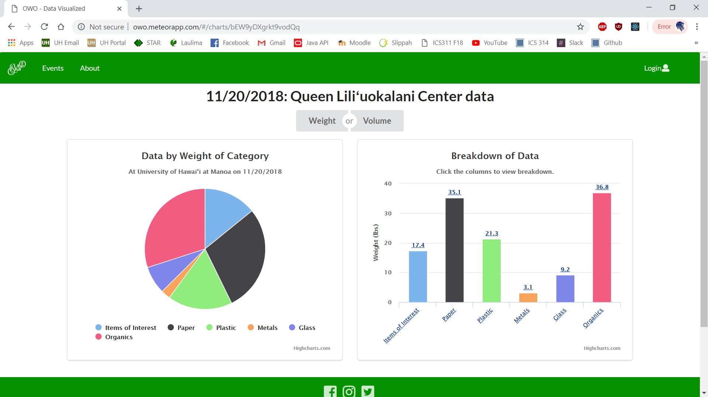

  
  

## About

The inspiration for this app originated from the 2018 HACC competition. The theme was sustainability, and our job was to create an app that made data input for trash audits easier. Currently, data was done with simple paper and pen; the recorded data was then copied into an excel spreadsheet and further formatted by hand for individual graphs. We created an app that had an easy-to-use input page that took the data and created graphs in real time of the data that was inputted. Additionally, we created an Events page to show past and upcoming trash audits.
The Oahu Waste Organizer was then taken and adapted to fit the criteria of our 314 Final Project. It was updated to use Semantic UI, React, and MongoDB, and was further improved upon by myself, Alton Lee, and Jake Weber.
To see the official Github page of our 314 project, it is available [here](https://oahu-waste-organizer.github.io/). 
Additionally, the deployed app for 314 is available [here](http://owo.meteorapp.com/#/).

## Role and Responsibilities

For the HACC competition, I was part of the data visualization team, and acted as team captain to establish group meetings and make sure that everyone was on the same page. I additionally helped create the About Page, Landing Page, and promotional video. For the ICS 314 project, which was basically a continuation of our work on the Oahu Waste Organizer, I worked in a team of 3 with Alton Lee and Jake Weber to further improve the app. I helped design/implement the appearance and functionality of the Landing Page and Input Page.

## What I learned

This experience was very valuable to me because it was the first hackathon I had ever entered. It was the first time I had participated on a team for a big project. I had zero experience on how making an app began, and because I worked on a team that comprised of some more experienced people, it opened my eyes to how different people focused on different things such as the front-end and back-end aspects of the app. Our team had nine people, which also opened my eyes to some of the challenges that came with being on a team with that many members. A big team is hard to manage, and a lot of the time, after finishing their one task, lots of people are just sitting around not knowing what to do. I don't think I would've ever participated in a hackathon had I not been pushed to do so in 314, but I was glad that I decided to have this experience, because I definitely don't regret it.

As for when I worked on it as a final project for 314, it was a different experience because I had a more involved role in creating the app, and I was working closer with less people. Everything I had to do to develop the app was more concentrated and specific, and I developed more experience with back-end programming as well. There were hard deadlines for everything (milestones), which made the process of creating the project easier.
